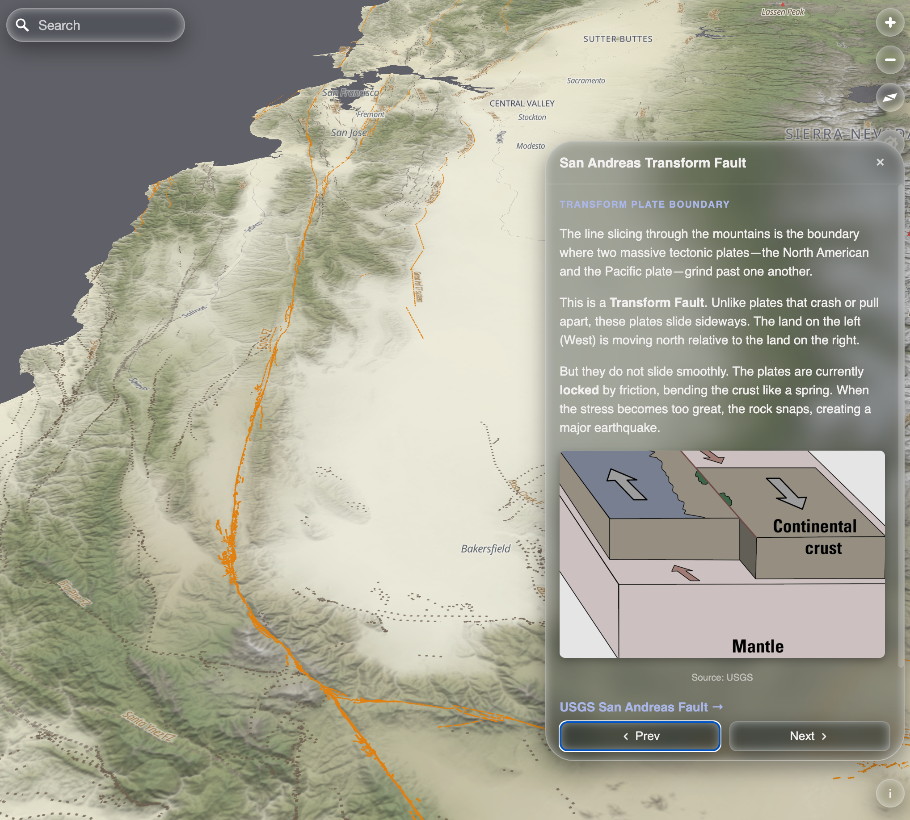

# MapLibre GL Tour Control



**Turn your map into an interactive storytelling experience.**

This community plugin adds a **Tour Widget** to your MapLibre map. You specify a list of locations and HTML content for each location and the widget displays that content. The Control can be used in four different ways:

### 1. Story Mode
*   The user clicks "Next," and the map flies to the next location and displays the narrative content for that site.

### 2. Walk Mode
*   The widget monitors the user's location. When they walk within range of a stop, the content panel opens automatically. (Requires the `GeolocateControl`)

### 3. Scavenger Mode
*   Similar to Walk Mode, but tracks progress. When a user finds a location, it is marked as "Found" and their score increases.

### 4. Explore Mode
*   The map allows the user to pan and zoom. When the user clicks near a Point of Interest, the panel expands to reveal details for that site.

---

## Key Features

*   **Simple To Use:** Create a simple JSON list of stops, create HTML for the stops, add the control to your map.
*   **Simple UI:** The Title, Content, and Controls all live in one panel that expands and collapses automatically. When the tour is not active, the control shrinks to a small button.
*   **Layer Effects:** Create dramatic reveals by automatically toggling map layers per slide (e.g., hide satellite imagery to reveal earthquake faults, then restore it when the user moves on).
*   **Zero Dependencies:** No external libraries, icons, or frameworks required. It drops right into any MapLibre project. (*Walk/Scavenger modes require the standard `GeolocateControl`*).
*   **GeoJSON Driven:** Define your entire tour (stops, camera angles, text, and effects) using a standard GeoJSON file.
*   **Glass Theme:** Can optionally use a beautiful, glass CSS theme that gives the tour and standard MapLibre controls a modern, frosted-glass aesthetic.

---

## Installation

Copy `maplibre-tour-control.js` to your project and import it directly.

```javascript
import { MapLibreTourControl } from './maplibre-tour-control.js';
```

## Usage

```javascript
const map = new maplibregl.Map({ /* ... */ });

map.on('load', () => {
    
    const tour = new MapLibreTourControl({
        // 1. Where is the tour manifest?
        manifest: `https://raw.githubusercontent.com/corb555/geo-tour/main/${tourName}/tour_manifest.json`,
        
        // 2. Where is the HTML for each stop?
        contentBaseUrl: `https://raw.githubusercontent.com/corb555/geo-tour/main/${tourName}/content/`,

        // 3. Select Mode: 'story' | 'explore' | 'walk' | 'scavenger'
        mode: 'story',
    });

    map.addControl(tour, 'bottom-right');
});
```

---

## The Tour Manifest

The tour is controlled by a single GeoJSON file. This acts as the "script" for your tour, defining the stops, including the camera angles, and active map layers for every stop.

Each feature points to a separate **HTML Fragment** file containing the narrative text and images for that location. The order of features in the tour manifest determines the tour sequence in story mode.

**`tour_manifest.json`**

```json
{
  "type": "FeatureCollection",
  "tour_title": "Western US Geology", 
  "features": [
    {
      "type": "Feature",
      "geometry": { 
          "type": "Point", 
          "coordinates": [-122.19, 46.20] 
      },
      "properties": {
        "title": "Mt. St. Helens",
        "zoom": 12.5,
        "pitch": 75,
        "bearing": 180,
        "content_file": "st_helens.html",
        "effects": {
            "show": ["volcano-danger-zones"],
            "hide": ["satellite-imagery"]
        }
      }
    }
  ]
}
```

### Property Reference

| Property           | Type   | Description                                                 |
|:-------------------|:-------|:------------------------------------------------------------|
| **General**        |        |                                                             |
| `title`            | String | The name displayed in the dropdown header.                  |
| `content_file`     | String | Filename of the HTML snippet to load into the panel.        |
| **Story Mode**     |        |                                                             |
| `zoom`             | Number | Target zoom level.                                          |
| `pitch`            | Number | Target 3D tilt (0-85).                                      |
| `bearing`          | Number | Target compass rotation (0-360).                            |
| `effects`          | Object | `{ show: [], hide: [] }` - Toggles layer visibility.        |
| **Scavenger Mode** |        |                                                             |
| `clue`             | String | A hint displayed to the user before they find the location. |

---

## 📝 Tour Content Files

Each stop points to a content file (e.g., `yosemite.html`).

These files are simply **HTML Fragments**. You can include **any HTML that is valid inside a `<body>` tag**, such as headers, paragraphs, tables, images, links, and `<style>` blocks.

> **Do not** include the outer `<html>`, `<head>`, or `<body>` wrapper tags.

**Example Fragment (`yosemite.html`):**
```html
<p>
    <b>Yosemite National Park</b> is best known for its peaks and waterfalls, but within its nearly 
    1,200 square miles, you can find deep valleys and giant sequoias.
</p>
```

### Handling Images in HTML snippets
> ⚠️ To ensure images load correctly whether the tour is hosted locally or remotely (e.g., GitHub Raw), use the `{{BASE_URL}}` token in your HTML snippets. The control automatically replaces this with the configured `contentBaseUrl`.

```html
<!-- ✅ CORRECT -->


<!-- ❌ INCORRECT (Will break if tour is on remote server) -->

```

### Sample Content Package
[View a complete example tour package here (US West)](https://github.com/corb555/geo-tour/tree/main/USWest)

---

## 📂 Recommended Architecture

Hosting the tour content separately from your map application allows content creators to manage and share tours (text, images, coordinates) without touching the application code.

### 1. The Web App
These files live on your web server.

```text
/var/www/html/
├── index.html
├── maplibre-tour-control.js
└── maplibre-glass-theme.css
```

### 2. The Tour Data
These files can live in a separate folder or a remote repository (e.g., GitHub).

**Example Repo:** `https://github.com/username/tours/tree/main/yosemite`

```text
/
├── tour_manifest.json        <-- The Entry Point
└── content/
    ├── intro.html
    ├── yosemite.html
    └── images/
        └── diagram.png
```

---

## 🧊 The Glass Theme

This control works out of the box, but it is designed to look best with the **MapLibre Glass Theme**. This CSS theme gives the tour widget and standard MapLibre controls a modern, frosted-glass aesthetic.

**Usage:**
1.  Include `maplibre-glass-theme.css` in your HTML `<head>`.
2.  Add the class to your map container: `<div id="map" class="maplibre-glass-theme">`.

## Issues

If you have support questions or want to report issues, please create an issue in this repository.

## License
MIT